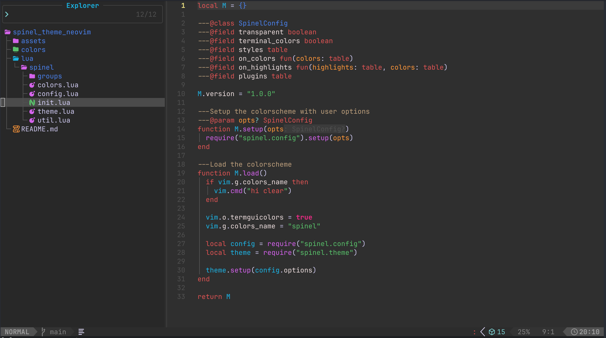

# spinel.nvim

A Neovim colorscheme based on [Shopify's Spinel theme](https://github.com/Shopify/vscode-shopify-ruby/tree/main) for VSCode.



## Features

- Carefully crafted color palette matching the original Spinel theme
- Full Treesitter support with semantic highlighting
- LSP semantic tokens support
- Built-in support for popular plugins:
  - telescope.nvim
  - nvim-tree.lua
  - gitsigns.nvim
  - nvim-cmp
  - which-key.nvim
  - indent-blankline.nvim
  - lazy.nvim
- Transparent background option
- Customizable styles for comments, keywords, functions, and parameters
- LazyVim compatible

## Requirements

- Neovim >= 0.8.0
- `termguicolors` enabled

## Installation

### Using [lazy.nvim](https://github.com/folke/lazy.nvim)

```lua
{
  "Andersonvb/spinel.nvim",
  lazy = false,
  priority = 1000,
  opts = {},
}
```

### Using [packer.nvim](https://github.com/wbthomason/packer.nvim)

```lua
use {
  "Andersonvb/spinel.nvim",
  config = function()
    require("spinel").setup()
    vim.cmd.colorscheme("spinel")
  end
}
```

## Configuration

Spinel comes with sensible defaults. Call `setup()` before loading the colorscheme to customize:

```lua
require("spinel").setup({
  -- Enable transparent background
  transparent = false,

  -- Set terminal colors
  terminal_colors = true,

  -- Style customization
  styles = {
    comments = { italic = true },
    keywords = { italic = false, bold = false },
    functions = { italic = false, bold = false },
    parameters = { italic = true },
    booleans = { bold = true },
  },

  -- Override colors
  on_colors = function(colors)
    colors.bg = "#1a1a1a"
  end,

  -- Override highlight groups
  on_highlights = function(hl, colors)
    hl.Comment = { fg = colors.comment, italic = true }
  end,

  -- Plugin integration
  plugins = {
    auto = true, -- Auto-detect loaded plugins
    telescope = true,
    nvim_tree = true,
    gitsigns = true,
    cmp = true,
    which_key = true,
    indent_blankline = true,
    lazy = true,
  },
})
```

### LazyVim Configuration

```lua
return {
  {
    "Andersonvb/spinel.nvim",
    lazy = false,
    priority = 1000,
    opts = {
      transparent = false,
      styles = {
        comments = { italic = true },
        parameters = { italic = true },
      },
    },
  },
  {
    "LazyVim/LazyVim",
    opts = {
      colorscheme = "spinel",
    },
  },
}
```

## Color Palette

### UI Colors

| Name | Hex | Preview |
|------|-----|---------|
| Background | `#2f2f2f` |  |
| Background Dark | `#282828` |  |
| Background Highlight | `#3b3b3b` |  |
| Foreground | `#d1ccf1` |  |
| Border | `#404040` |  |

### Syntax Colors

| Name | Hex | Usage | Preview |
|------|-----|-------|---------|
| Comment | `#bea17f` | Comments |  |
| Red | `#dd5555` | Keywords, Types |  |
| Green | `#5ac16c` | Strings |  |
| Yellow | `#eee385` | Numbers |  |
| Orange | `#ff9a3b` | Parameters |  |
| Cyan | `#18b5e4` | Variables |  |
| Blue | `#4b82e9` | Classes, Modules |  |
| Teal | `#7dcfcf` | Symbols |  |
| Pink Light | `#eee0e0` | Properties |  |
| Pink | `#ed2a88` | self, nil, true |  |
| Magenta | `#d464eb` | Function definitions |  |
| Lime | `#a6cc5f` | Regexp |  |

## Verification

After installation, verify the theme is working:

1. Load the colorscheme: `:colorscheme spinel`
2. Open various file types (Ruby, Lua, Python, etc.)
3. Use `:Inspect` on tokens to verify highlight groups
4. Open Telescope, nvim-tree to verify plugin integration
5. Test transparent mode: `opts = { transparent = true }`

## License

This colorscheme is available as open source under the terms of the [MIT License](LICENSE).
